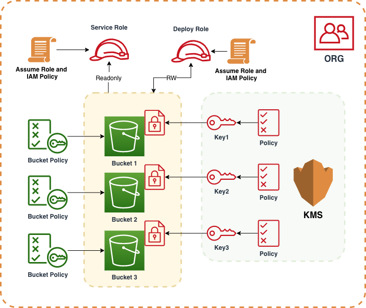

# Samples of Orchestration on AWS

This project has few samples of CloudFormation and Terraform scripts to do orchestration on AWS. 

## Prerequisite

To use this project:

- You must have an AWS profile
- You have installed [terraform](http://terraform.io) 0.11.X
- Nice to have [make](https://www.gnu.org/software/make/manual/make.html)
- You have a VPC created in your AWS account and is set as the default VPC
- You have exported your default AWS Region

## Usecase
1. Three S3 buckets [SSE-KMS encrypted]
    - homesite-takehome-test-Staging-<random number>
    - homesite-takehome-test-Raw-<random number>
    - homesite-takehome-test-Transformed-<random number>
  
2. Service Role/Policy
	- complete access to S3
	- complete access to Glue
	- complete access to Lambda

3. KMS Keys
	- 1 key per S3 bucket, 3 total
	- Service role access to keys
	- root principal access to keys
	- deploy role access to keys
	
4. Bucket policies 
   - disallow public access
   - attach kms key
   - deny non-https connections
   - allow only read access to service role

## Design
Here is a quick view of the AWS resources. 



## Flavors
Here are the flavors of orchestration in this sample. 

| Tool | Location |
| ----- | ------ |
| AWS CloudFormation | [cloudformation](cloudformation) |
| Terraform | [terraform](terraform) |
| AWS CDK | TBD |


## Development

```bash
$ make

  ## AWS-ORCHESTRATION-SAMPLE

  aws-orchestration-sample =>    make cfn/create                Create the sample cloudformation stack. vars: deployrole. Example: make cfn/create deployrole="arn:aws:iam::1234567890:role/deployRole"
  aws-orchestration-sample =>    make cfn/delete                Delete the sample cloudformation stack.
  aws-orchestration-sample =>    make tf/plan                   Plan the sample terraform stack. Make changes to the variable.tf file.
  aws-orchestration-sample =>    make tf/apply                  Create the sample terraform stack. Make changes to the variable.tf file.
  aws-orchestration-sample =>    make tf/destroy                Create the sample terraform stack. Make changes to the variable.tf file.
  aws-orchestration-sample =>    make help                      This is default and it helps

```

## Implementation
* Deploy role ARN is assumed to be an input parameter
* The CloudFormation script uses nested stacks.
* Terraform state is stored locally.
* _variable.tf_ has the values for the terraform stack. 

## Block Public Access to S3
Add the following as an S3 bucket propery in the CloudFormation:

```json
"PublicAccessBlockConfiguration" : {
    "BlockPublicAcls" : true,
    "BlockPublicPolicy" : true,
    "IgnorePublicAcls" : true,
    "RestrictPublicBuckets" : true
}
```

Terraform:

```
resource "aws_s3_bucket_public_access_block" "sample" {
  bucket = aws_s3_bucket.sample.id

  block_public_acls   = true
  block_public_policy = true
}
```
> Note: more properties can be added

## CICD
TBD